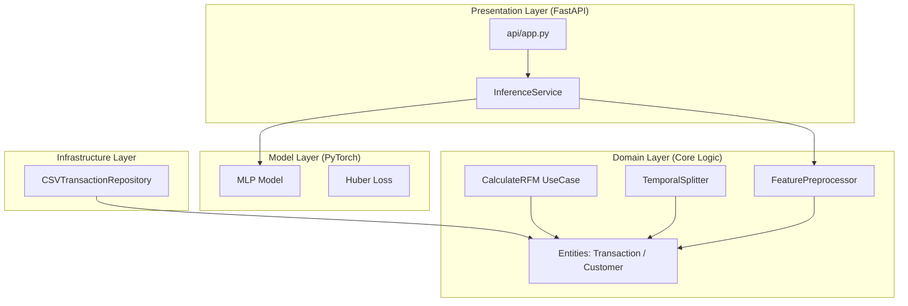
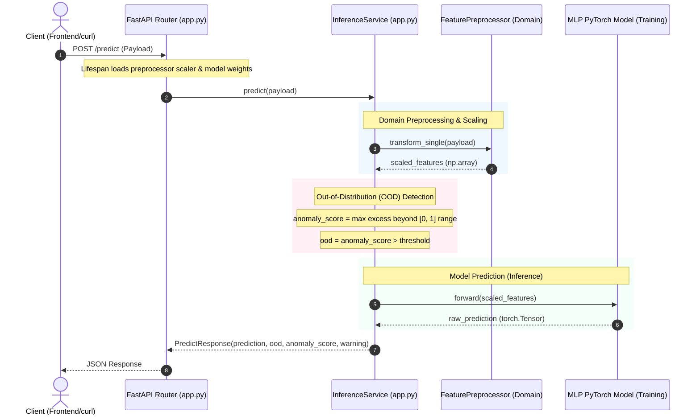

# E-commerce CLV Predictor - Architecture (Detailed)

This project is built using **Clean Architecture** principles to separate business logic, infrastructure, and presentation details. This structure ensures that domain entities and use cases are independent of database implementations, web frameworks, and machine learning libraries.

## System Architecture Layout

```text
+-----------------------------------------------------------+
|                  Presentation Layer                       |
|         Vite React Frontend <---> FastAPI Backend         |
+-----------------------------------------------------------+
                            |
                            v
+-----------------------------------------------------------+
|                  Inference / Model Service                |
|                     InferenceService                      |
+-----------------------------------------------------------+
                            |
         +------------------+------------------+
         |                                     |
         v                                     v
+-----------------------+             +---------------------+
|    Domain Layer       |             |     Model Layer     |
|   FeaturePreprocessor |             |   MLP (PyTorch)     |
|   CalculateRFM        |             |   HuberLoss         |
|   TemporalSplitter    |             +---------------------+
+-----------------------+
         |
         v
+-----------------------------------------------------------+
|                 Infrastructure Layer                      |
|  CSVTransactionRepository / DBTransactionRepository       |
+-----------------------------------------------------------+
```

### Component Dependency Diagram

The diagram below shows the component layout and how dependencies point inwards towards the Domain Layer, satisfying Clean Architecture constraints:



---


## Architectural Layers

### 1. Domain Layer (Core Business Logic)
The Domain layer contains the core rules of the application. It is independent of all external libraries (except helper libraries like `numpy` or `pandas` used purely for math/data structures) and has no knowledge of FastAPI or PyTorch.
- **Entities** (`backend.domain.entities`): Defines the basic data structures like `Transaction` and `Customer`.
- **Use Cases** (`backend.domain.use_cases`): Orchestrates application actions. For example, `CalculateRFM` calculates recency, frequency, and monetary features for each customer.
- **Services** (`backend.domain.services`): Domain logic that doesn't fit in a single use case, such as `FeaturePreprocessor` (feature scaling) and `TemporalSplitter` (chronological split of transactional data to prevent leakage).

### 2. Infrastructure Layer (Adapters & External Interfaces)
The Infrastructure layer provides implementations of the interfaces defined in the domain layer.
- **Data Loaders** (`backend.infrastructure.data_loaders`): Defines how transactions are loaded from disk or databases. `CSVTransactionRepository` parses raw transaction sheets (CSV/Excel) and converts them into Domain `Transaction` entities.

### 3. Model / Training Layer (Deep Learning Core)
The Model layer contains the PyTorch MLP (Multi-Layer Perceptron) model architecture, the training loop with Huber Loss, and hyperparameter tuning sweeps.
- **Model Topology** (`backend.training.model`): Defines `MLP`, a sequential neural network with configurable hidden dimensions and dropout.
- **Tuning and Loop** (`backend.training.loop`, `backend.training.tuning`): Implements deterministic data loaders, standard training steps, and parameter sweeps.

### 4. Presentation / API Layer (Delivery Mechanism)
The FastAPI app acts as the delivery mechanism.
- **Inference App** (`backend.api.app`): Hosts `/predict`, `/predict/batch`, and `/health` endpoints. It initializes `InferenceService`, loads model weights and the preprocessing scaler, scales input payloads via the Domain `FeaturePreprocessor`, runs out-of-distribution (OOD) verification, and performs model forward passes.

---

## End-to-End Inference Sequence

The following Mermaid sequence diagram illustrates how a request flows through the layers during prediction:



